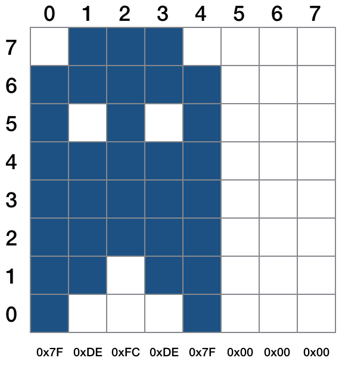

# HT16K33Matrix 1.1.0

Hardware driver for [Adafruit 1.2-inch monochrome LED matrix display](http://www.adafruit.com/products/1854) based on the Holtek HT16K33 controller. The LED communicates over any imp I&sup2;C bus.

### Changes from 1.0.0

The class incorporates its own Ascii character set, from 32 (&nbsp;) to 127 (&deg;). This character set is now proportionally spaced for a more aesthectically pleasing output. Code built using version 1.0.0 should be checked, especially if you are assuming non-proportionally spaced characters. Ascii code 127 is now a degrees sign, not a copyright symbol.

The class also supports up to 32 user-definable characters.

The class’ API remains almost unchanged. The optional angle passed into the second parameter of *init()* may now be a value in degrees, but this will not cause problems for existing code. However, *displayIcon()* now takes an array of 1-8 8-bit values, each specifying a *column* (bit 7 at the top) of the character, not a row.

## Class Usage

## Constructor: HT16K33Matrix(*impI2cBus[ i2cAddress][, debug]*)

To instantiate an HT16K33Matrix object pass the I&sup2;C bus to which the display is connected and, optionally, its I&sup2;C address. If no address is passed, the default value, `0x70` will be used. Pass an alternative address if you have changed the display’s address using the solder pads on rear of the LED’s circuit board.

The passed imp I&sup2;C bus must be configured **before** the HT16K33Matrix object is created.

Optionally, you can pass `true` into the *debug* parameter. This will cause debugging information to be posted to the device log. This is disabled by default.

```squirrel
hardware.i2c89.configure(CLOCK_SPEED_400_KHZ);
led <- HT16K33Matrix(hardware.i2c89);
```

## Class Methods

## init(*[brightness][, angle]*)

Call *init()* to set the matrix’s initial settings. All the parameters are optional.

- *brightness* sets the LED intensity (duty cycle) to a value between 0 (dim) and 15 (maximum); the default is 15.
- *angle* specifies the optional angle by which any image drawn on the matrix will be rotated. You can pass a degree value, which will be converted into the internal format &mdash; 0 (0&deg;), 1 (90&deg;), 2 (180&deg;) or 3 (270&deg;) &mdash; or pass an internal value. Values outside the range -360 to +360 are set to zero.

```squirrel
// Set matrix to max brightness and to
// rotate all characters by 180 degrees

led.init(15, 2);
```

```squirrel
// Set matrix to mid brightness and to
// rotate all characters 90 degrees anticlockwise

led.init(8, -90);
```

## displayChar(*asciiValue[, center]*)

Call *displayChar()* to write an Ascii character to the matrix. The value is optional; if no value is specified, the display will be set to display a space character. Unless the matrix is set to inverse video mode, this has the same effect as *clearDisplay()*.

```squirrel
// Set the display to show ‘A’

led.displayChar(65);
```

## displayIcon(*glyphMatrix[, center]*)

Call *displayIcon()* to write an non-standard character or graphic to the matrix. The character is passed as an array containing one to eight 8-bit integer values, each value a bit pattern for one of the *columns* making up the character. Each column value’s bits are set or unset according to the diagram below, ie. bit 0 is the topmost pixel of the column and bit 7 is the lowest pixel of the column.



The custom character shown above is formed from five 8-bit values, each representing one of the five columns that make up the character. These five values, shown below each column, form the array passed into *displayIcon()*.

If no array is passed, or an empty or incomplete array is passed, the function returns with no effect.

If `true` is passed into the optional parameter *center*, the glyph will be centered on the matrix.

```squirrel
// Display a smiley on the matrix

local smiley = [0x3C, 0x42, 0x95, 0xA1, 0xA1, 0x95, 0x42, 0x3C];
led.displayIcon(smiley);
```

## displayLine(*line*)

Call *displayLine()* to write a string to the matrix. The characters (one or more) comprising the string will scroll leftward. If no string is passed, or an empty string is passed, the function returns with no effect.

```squirrel
// Display 'The quick brown fox...' on the display

local text = "The quick brown fox jumped over the lazy dog";
led.displayline(text);
```

## defineChar(*asciiCode, glyphMatrix*)

You can save user-defined characters for future use using *defineChar()*. The first parameter is a numeric code to identify the character: permitted values are 0 through 31.

The *glyphMatrix* parameter takes an array containing one to eight 8-bit integer values, each value a bit pattern for one of the *columns* making up the character. Each column value’s bits are set or unset according to the diagram below, ie. bit 0 is the topmost pixel of the column and bit 7 is the lowest pixel of the column. See *displayIcon()*, above, for further guidance on forming new characters.

Once defined a user-defined character can be presented using *displayChar()* passing in its character code as the *asciiValue* parameter. You can add your characters to a string to be presented by *displayLine()* by adding it as a single-character string:

```
local smiley = [0x3C, 0x42, 0x95, 0xA1, 0xA1, 0x95, 0x42, 0x3C];
local smileyChar = 0;
led.defineChar(smileyChar, smiley);

local displayString = "I'm being chased by a...     + smileyChar.tochar() + "    !!!";
led.displayLine(displayString);
```

## clearDisplay()

Call *clearDisplay()* to blank the matrix.

## setInverseVideo(*state*)

Call *setInverseVideo()* to specify whether the characters on the matrix should be displayed in inverse video (dark on light) or standard video (light on dark). Pass `true` to select inverse video mode, `false` to select standard video. If no value is passed, inverse mode is selected automatically.

```squirrel
// Display 'The quick brown fox...' on the display in standard...

local text = "The quick brown fox jumped over the lazy dog";
led.displayline(text);

// ...and in inverse video

led.setInverseVideo(true);
led.displayLine(text);
```

## setBrightness(*brightness*)

Call *setBrightness()* to set the matrix’s brightness (duty cycle) to a value between 0 (dim) and 15 (maximum). The value is optional; the matrix will be set to maximum brightness if no value is passed.

```squirrel
// Set the display brightness to 50%

led.setBrightness(8);
```

## powerDown()

The display can be turned off by calling *powerDown()*.

## powerUp()

The display can be turned on by calling *powerup()*.

## License

The HTK16K33Segment library is licensed under the [MIT License](./LICENSE).
